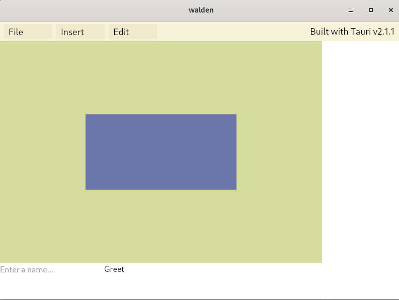

# Walden
Photo manipulation software using JavaScript and Rust inspired by applications like Photoshop and Photopea.
<br >

# Current Stage
A webview desktop application that serves a photo manipulation user interface to a front-end user. 

This code is currently being adapted from [WebAppPhotoEdits](https://github.com/ClaytonWas/WebAppPhotoEdits) into a more performant back-end with context provided by an imagefile and HTML canvas. 


[Deployed Website](https://webappphotoedits.onrender.com/) (previous build) <br >
This may require some time open to reawaken the render instance.

### Installation
1. Install packages (built using Node v20.15.1):
   ```bash
   npm ci
   ```
2. Run local server:
   ```bash
   npm run tauri dev
   ```

## Recommended IDE Setup

- [VS Code](https://code.visualstudio.com/) + [Tauri](https://marketplace.visualstudio.com/items?itemName=tauri-apps.tauri-vscode) + [rust-analyzer](https://marketplace.visualstudio.com/items?itemName=rust-lang.rust-analyzer)
